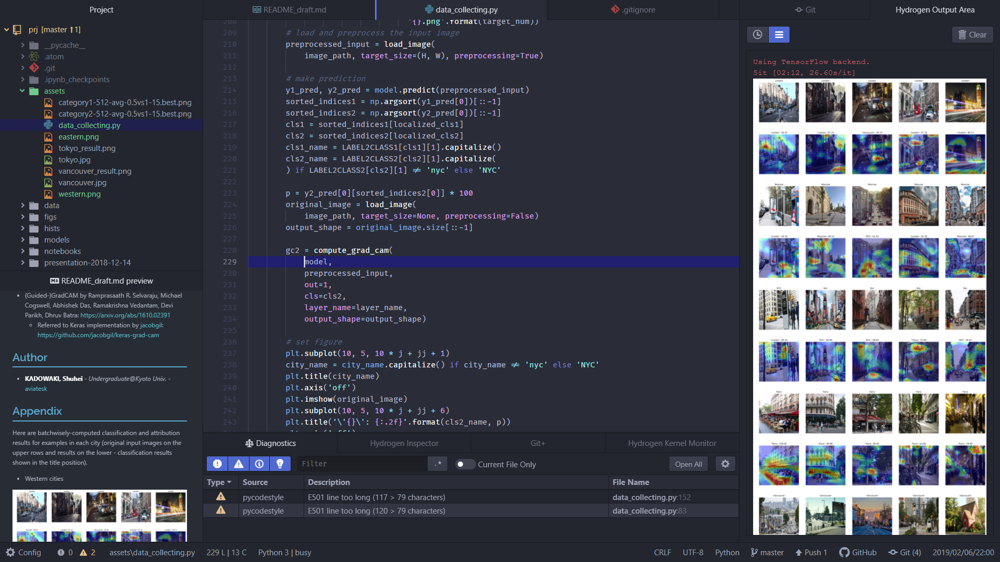

# Atom customs - aviatesk

Let me show off my Atom customs a bit and explain how to restore them.


## Overview




## Main features

- Fine-tuned UI design based on [Ariake Dark Syntax](https://atom.io/themes/ariake-dark-syntax), with the inspiration by [四季花鳥図屏風](https://artsandculture.google.com/asset/%E5%9B%9B%E5%AD%A3%E8%8A%B1%E9%B3%A5%E5%9B%B3%E5%B1%8F%E9%A2%A8/1gHXp2NQApzNHg?hl=en), 雪舟
- (*Atomically*-naturally) Powerful Git support environments !
- Fancy Emacs-like key bindings (based on [emacs-plus](https://atom.io/packages/emacs-plus), but a lot more tuned according to my preferences)
- Interactive and integrated coding environment for Python & Julia powered by [Juno](http://junolab.org/), [IDE-Python](https://atom.io/packages/ide-python) and [Hydrogen](https://atom.io/packages/hydrogen)
- Strong support for writing markdown documents with [Markdown-Writer](https://atom.io/packages/markdown-writer) and [Markdown-Preview-Enhanced](https://atom.io/packages/markdown-preview-enhanced)
- Combining the two of the above, even support for writing [Weave.jl document](http://weavejl.mpastell.com/stable/) & [pweave-document](http://mpastell.com/pweave/)


<h2> Set-ups </h2>

<h3> Steps </h3>

<!-- @import "[TOC]" {cmd="toc" depthFrom=3 depthTo=3 orderedList=true} -->
<!-- code_chunk_output -->

1. [Get requirements](#get-requirements)
2. [Re-install packages](#re-install-packages)
3. [Modify paths](#modify-paths)
4. [Make Git globally ignore .atom/config.cson files](#make-git-globally-ignore-atomconfigcson-files)
5. [Change default scopes of Autocomplete-Paths](#change-default-scopes-of-autocomplete-paths)
6. [Set global MPE style](#set-global-mpe-style)
7. [Enable Juno startup config](#enable-juno-startup-config)
8. [Fix a bug within Atom-IDE-Debugger-Python](#fix-a-bug-within-atom-ide-debugger-python)

<!-- /code_chunk_output -->


### Get requirements

Each link below leads to its installation instruction.

- Font families:
	* [Fira-Code](https://github.com/tonsky/FiraCode)
	* For Japanese rendering:
		+ [Myrica M](https://myrica.estable.jp/)
		+ [Source Han Code JP](https://github.com/adobe-fonts/source-han-code-jp/releases/tag/2.011R)
- [Git](https://git-scm.com/book/en/v2/Getting-Started-Installing-Git)
    * Windows: [Git-bash](https://sp18.datastructur.es/materials/lab/lab1setup/windows.html#b-everything-else)
- Julia
- Python & IPython
	* [Python-Language-Server](https://github.com/lgeiger/ide-python)


### Re-install packages

Restore my favorite packages that are written in [my-packages.txt](./my-pacakge.txt):

```bash
$ apm install --packages-file my-packages.txt
```


### Modify paths

Files below contain absolute paths (in macOS format by default) to files that are used along with my settings. They should be modified according to your environment.

- [config.cson](./config.cson):
    * `*.ide-python.python`: Path to executable Python (with Python-Language-Server installed)
    * `*.termination.core.shell`: Path to executable bash shell
- [global-shell-commands.cson](./global-shell-commands.cson):
    * `zen-style`, `shiki-style`: Path to ~/.atom/
    * `create-project-config`: Path to ~/.atom/
    * `create-julia-project-config`: Path to ~/.atom/
    * `process-md`, `process-md-remain`: Path to ~/.atom/scripts/process-md.bat
        + (In macOS or Linux, replacing it with the path to ~/.atom/scripts/process-md.sh should work instead)
- [snippets.cson](./snippets.cson):
    * `MPE: Numbering sections from H1'`: Path to ~/.atom/mpe-styles/numbering-from-h1.less
    * `MPE: Numbering sections from H2'`: Path to ~/.atom/mpe-styles/numbering-from-h2.less
    * `MPE: 'Fancy One-Dark Theme'`: Path to ~/.atom/mpe-styles/fancy-one-dark.less
- styles.less (**on `shiki-style` branch**)
    * Path to ~/.atom/assets/shikikacho-zubyobu-v1.jpg
- [scripts/julia.cson](./scripts/julia.cson):
	* `*.julia-client.juliaPath`: Path to executable Julia


### Make Git globally ignore .atom/config.cson files

[Atomic-Management](https://github.com/harmsk/atomic-management) enables us to use *per-project* config settings for Atom by creating .atom/config.cson files in each project's root directory. But usually we want such a kind of file to be ignored by Git.  
We can make Git ignore .atom/config.cson files globally except ~/.atom/config.cson by following steps:
1. `$ git config --global core.excludesfile ~/.gitignore_global`
2. Open or create [~/.gitignore_global](../.gitignore_global)
3. Add the code snippet below

> .gitignore_global

```git
# Ignore Atom per-project config settings except the root config setting
!~/.atom
!~/.atom/*
.atom/
.atom/*
```


### Change default scopes of Autocomplete-Paths

Additional scope configurations of Autocomplete-Paths don't work...
Thus I modified the original [default-scopes.js](scripts/default-scopes.js).

```bash
$ rm packages/autocomplete-paths/lib/config/default-scopes.js
$ link scripts/default-scopes.js packages/autocomplete-paths/lib/config/default-scopes.js
```


### Set global MPE style

I tuned [mpe-styles/style.less](mpe-styles/style.less) sheet so that within Markdown-Preview-Enhanced, we can do:
- Preview markdown documents in GFM style
- Fancy (& robust) font rendering
- Render HTML with TOC's sidebar bottom on left-above

We can enable the settings above globally by linking mpe-styles/style.less to ~/.mume/style.less:

```bash
$ link ~/.atom/mpe-styles/style.less ~/.mume/style.less
```

(Other .less style sheets in [mpe-styles directory](./mpe-styles) can be accessed via snippets, thus we don't need to link them to somewhere else.)


<!-- ### Set-up Juno

#### Install Juno package

> Julia REPL

```julia
using Pkg
Pkg.add("Juno")
``` -->

### Enable Juno startup config

[scripts/juno_startup.jl](scripts/juno_startup.jl) contains Juno-specific Julia startup configs:
- Use Atom syntax-highlight scheme within [OhMyREPL.jl](https://github.com/KristofferC/OhMyREPL.jl)
- Make color theme that matchs [Ariake Dark Syntax](https://atom.io/themes/ariake-dark-syntax) for [PlotThemes.jl](https://github.com/JuliaPlots/PlotThemes.jl)

Enable it by making symbolic link of scripts/juno_startup.jl to ~/.julia/config/juno_startup.jl:

```bash
$ link ~/.atom/scripts/juno_startup.jl ~/.julia/config/juno_startup.jl
```


### Fix a bug within Atom-IDE-Debugger-Python

[Atom-IDE-Debugger-Python](https://github.com/facebookarchive/atom-ide-debugger-python), Python debugger working with Atom-IDE, contains the bug of sending annoying duplicated launch responses, just by default installation: [issue](https://github.com/facebookarchive/atom-ide-debugger-python/issues/7)

I modified the default released Main.js according to the commit [90629e](https://github.com/facebookarchive/nuclide/commit/90629ee9fded9fb1f8dc761b827bfddbb19aeeb1) and saved it as [scripts/Main.js](scripts/Main.js). The command below should get rid of the bug:

```bash
$ cp ~/.atom/assets/Main.js ~/.atom/packages/atom-ide-debugger-python/node_modules/atom-ide-debugger-python/VendorLib/vs-py-debugger/out/client/debugger/Main.js
```


## Author

- **KADOWAKI, Shuhei** - *Undergraduate@Kyoto Univ.* - [aviatesk]

[aviatesk]: https://github.com/aviatesk


<!-- ## Acknowledgements -->
