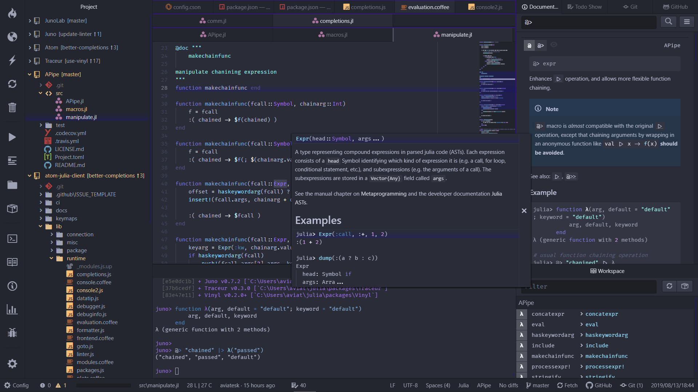
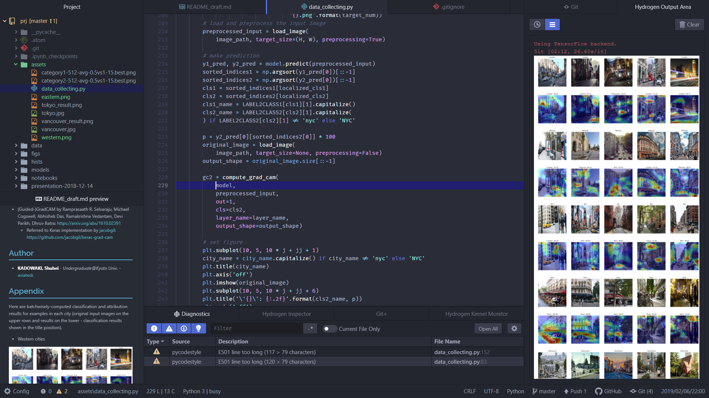

# Atom customs - aviatesk

Let me show off my Atom customs a bit and explain how to restore them.


## Overview

> Juno



> Hydrogen




## Main features

- Fine-tuned UI design based on [Ariake Dark Syntax](https://atom.io/themes/ariake-dark-syntax), with the inspiration by [四季花鳥図屏風](https://artsandculture.google.com/asset/%E5%9B%9B%E5%AD%A3%E8%8A%B1%E9%B3%A5%E5%9B%B3%E5%B1%8F%E9%A2%A8/1gHXp2NQApzNHg?hl=en), 雪舟
- (*Atomically*-naturally) Powerful Git support environments !
- Fancy Emacs-like key bindings (based on [emacs-plus](https://atom.io/packages/emacs-plus), but a lot more tuned according to my preferences)
- Interactive coding environment powered by [Juno](http://junolab.org/), and [Hydrogen](https://atom.io/packages/hydrogen)
- Strong support for writing markdown documents with [Markdown-Writer](https://atom.io/packages/markdown-writer) and [Markdown-Preview-Enhanced](https://atom.io/packages/markdown-preview-enhanced)
- Combining the two of the above, even support for writing [Weave.jl document](http://weavejl.mpastell.com/stable/) & [pweave-document](http://mpastell.com/pweave/)


<h2> Set-ups </h2>

<h3> Steps </h3>

<!-- @import "[TOC]" {cmd="toc" depthFrom=3 depthTo=3 orderedList=true} -->
<!-- code_chunk_output -->

1. [Get fonts](#get-fonts)
2. [Re-install packages](#re-install-packages)
3. [Modify paths](#modify-paths)
4. [Globally ignore .atom/config.cson files by Git](#globally-ignore-atomconfigcson-files-by-git)
5. [Set up global node_modules](#set-up-global-node_modules)
6. [Make symbolic links](#make-symbolic-links)

<!-- /code_chunk_output -->


### Get fonts

- [Fira-Code](https://github.com/tonsky/FiraCode)
- [Myrica M](https://myrica.estable.jp/)
- [Source Han Code JP](https://github.com/adobe-fonts/source-han-code-jp/releases/tag/2.011R)


### Re-install packages

Restore my favorite packages that are written in [my-packages.txt](./my-pacakge.txt):

```bash
$ apm install --packages-file my-packages.txt
```


### Modify paths

Files below contain absolute paths (in Windows-format by default) to files that are used along with my settings. They should be modified according to your environment.

- [config.cson](./config.cson): `*.termination.core.shell`
- [global-shell-commands.cson](./global-shell-commands.cson)
- [snippets.cson](./snippets.cson#L190-L244)


### Globally ignore .atom/config.cson files by Git

[Atomic-Management](https://github.com/harmsk/atomic-management) enables us to use *per-project* config settings for Atom by creating .atom/config.cson file in each project's root directory. But usually we want such a kind of file to be ignored by Git.  
We can make git globally ignore .atom/config.cson files by following steps:
1. `$ git config --global core.excludesfile ~/.gitignore_global`
2. Open or create [~/.gitignore_global](../.gitignore_global)
3. Add the code snippet below

> .gitignore_global

```git
# Ignore Atom per-project config settings except the root config setting
**/.atom
**/.atom/*
```


### Set up global node_modules

Set-up global node_modules where [linter-eslint](https://github.com/AtomLinter/linter-eslint) and [linter-tslint](https://github.com/AtomLinter/linter-tslint) falls back where there is no installation of eslint, TypeScript & tslint.

```bash
npm install -g eslint babel-eslint eslint-config-airbnb eslint-plugin-import eslint-plugin-react eslint-plugin-jsx-a11y typescript tslint
```


### Make symbolic links

I prepared [scripts](scripts/) to make some related packages work better.
The commands below will make those scripts active by making symbolic links to an appropriated location.

(***Note only for me***: The commands below can easily executed with <kbd>ctrl-alt-shift-enter</kbd>, which would invoke [script execution functionality of Markdown Preview Enhanced](https://shd101wyy.github.io/markdown-preview-enhanced/#/code-chunk))

#### Set global MPE style

I tuned [mpe-styles/style.less](mpe-styles/style.less) sheet so that within Markdown-Preview-Enhanced, we can do:
- Preview markdown documents in GFM style
- Fancy (& robust) font rendering
- Render HTML with TOC's sidebar bottom on left-above

We can enable the settings above globally by linking mpe-styles/style.less to ~/.mume/style.less:

```bash {cmd}
rm ~/.mume/style.less
link ~/.atom/mpe-styles/style.less ~/.mume/style.less
```

(Other .less style sheets in [mpe-styles directory](mpe-styles/) can be accessed via snippets, thus we don't need to link them to somewhere else.)

#### Enable Julia startup config

[scripts/startup.jl](./scripts/startup.jl) is my startup script for Julia: `ARGS` can be configured by _per-project_ configs via [Atomic-Management](https://github.com/harmsk/atomic-management).

[scripts/junostartup.jl](./scripts/junostartup.jl) contains:
- [OhMyREPL.jl](https://github.com/KristofferC/OhMyREPL.jl) color theme using `Juno.syntaxcolors`
- hacks on REPL completions within Juno debugger that enables _complete_ completions including local bindings

```bash {cmd}
rm ~/.julia/config/startup.jl ~/.julia/config/junostartup.jl
link ~/.atom/scripts/startup.jl ~/.julia/config/startup.jl
link ~/.atom/scripts/junostartup.jl ~/.julia/config/junostartup.jl
```


## Author

- **KADOWAKI, Shuhei** - _Undergraduate@Kyoto Univ._ - [aviatesk]

[aviatesk]: https://github.com/aviatesk


<!-- ## Acknowledgements -->
